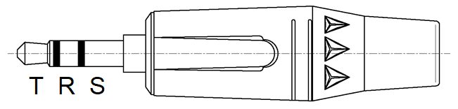

6 Pin Hirose Connector
----------------------

View:

* Female receptacle/jack viewed from mating face
* Male plug solder cups viewed from assembly face

Pinout map / wire color map:

* 1 - RED (N/C)
* 2 - GRN (DATA)
* 3 - YEL (SENSE)
* 4 - BLK (GND)
* 5 - WHT (N/C)
* 6 - BLU (N/C)

6 Pin Male Plug Hirose P/N: HR10A-7P-6P(73)

6 Pin Female Jack Hirose P/N: HR10A-7J-6S(73)

Cable Retention Crimp Tool Hirose P/N: HR10A-TC-02

5 Pin Amp Connector
-------------------

View:

* Female receptacle/jack viewed from mating face
* Male plug solder cups viewed from assembly face

5 Pin Male Plug (silver plated) Amp P/N: T3360001U

5 Pin Male Plug (gold plated) Amp P/N: T3360018U

8 Pin 8P8C Connector
--------------------

View:

* Male plug contacts from mating face

Kenwood Portable Accessory Connector
------------------------------------

View:

* Female jack contacts from mating face (radio side)

Motorola XTS4000 Accessory Connector
------------------------------------

View:

* Female jack contacts from mating face (radio side)

15 Pin DSUB Connector (2 row)
-----------------------------

View:

* Male plug solder cups viewed from assembly face

Harris 9 Pin Portable Accessory Connector
-----------------------------------------

3.5mm TRS Connector
-------------------

View:

* Female jack contacts from mating face (radio side)

AC100A
------

* 6 pin male plug Hirose to 6 pin male plug Hirose cable
* Wired straight through (pin 1 to pin 1, pin 2 to pin 2, etc)
* Pins 1, 5, and 6 are electrically connected in the cable assembly, however are not connected inside the KFDtool adapter

AC101A
------

* 6 pin male plug Hirose pigtail
* Pins 1, 5, and 6 are electrically connected in the cable assembly, however are not connected inside the KFDtool adapter

AC102A
------

* 6 pin female jack Hirose pigtail
* Pins 1, 5, and 6 are electrically connected in the cable assembly, however are not connected inside the KFDtool adapter

AC103A
------

* 6 pin female jack Hirose to 5 pin male plug Amp
* Equivalent to Motorola TKN8210 cable

Pinout:

* Amp Pin 1 - Hirose Pin 5
* Amp Pin 2 - Hirose Pin 1
* Amp Pin 3 - Hirose Pin 2
* Amp Pin 4 - Hirose Pin 4
* Amp Pin 5 - Hirose Pin 4

AC104B
------

* 6 pin female jack Hirose to 8 pin male plug 8P8C
* Equivalent to Kenwood KPG-115 cable

Pinout:

* 8P8C Pin 1 - Hirose Pin 4
* 8P8C Pin 2 - Hirose Pin 2
* 8P8C Pin 5 - (Cathode) Schottky Diode (Anode) - Hirose Pin 2
* 8P8C Pin 6 - Hirose Pin 4

AC106A
------

* 6 pin female jack Hirose to male Kenwood portable accessory connector
* Equivalent to Kenwood KPG-93 cable

Pinout:

* Accessory Pin 1 - Hirose Pin 4
* Accessory Pin 8 - Hirose Pin 4
* Accessory Pin 10 - Hirose Pin 4
* Accessory Pin 12 - (Cathode) Schottky Diode (Anode) - Hirose Pin 2
* Accessory Pin 13 - Hirose Pin 2

AC107A
------

* 6 pin female jack Hirose to male Motorola XTS4000 accessory connector
* Equivalent to Motorola CKN6886/0182297T15 cable

Pinout:

* Accessory Pin 1 - Hirose Pin 4
* Accessory Pin 8 - Hirose Pin 4
* Accessory Pin 9 - Hirose Pin 2
* Accessory Pin 13 - Remove

AC108A
------

* 6 pin female jack Hirose to male 15 pin DSUB plug (2 row)
* Equivalent to Aeroflex/IFR cable 51190/6041-4201-200
* Backshell must have a low profile due to faceplate protrusion

Pinout:

* DB15 pin 5 - Hirose Pin 2
* DB15 pin 7 - Hirose Pin 4
* DB15 pin 8 - 2k Resistor - Hirose Pin 2
* DB15 pin 13 - Hirose Pin 2

AC109A
------

* 6 pin female jack Hirose to male Harris 9 pin portable accessory connector
* Equivalent to Harris 12082-0400-A1 cable

Pinout:

* Accessory Pin 3 - 20k Resistor - Hirose Pin 4
* Accessory Pin 5 - Hirose Pin 4
* Accessory Pin 6 - Hirose Pin 2
* Accessory Pin 9 - Hirose Pin 4

AC110A
------

* 6 pin female jack Hirose to male 3.5mm TRS plug

Pinout:

* TRS Tip - Hirose Pin 2
* TRS Ring - Hirose Pin 3
* TRS Sleeve - Hirose Pin 4
